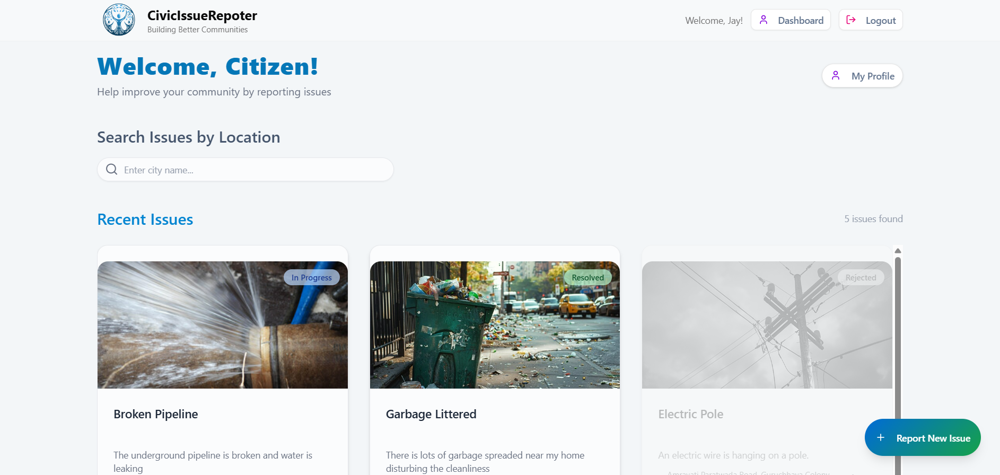
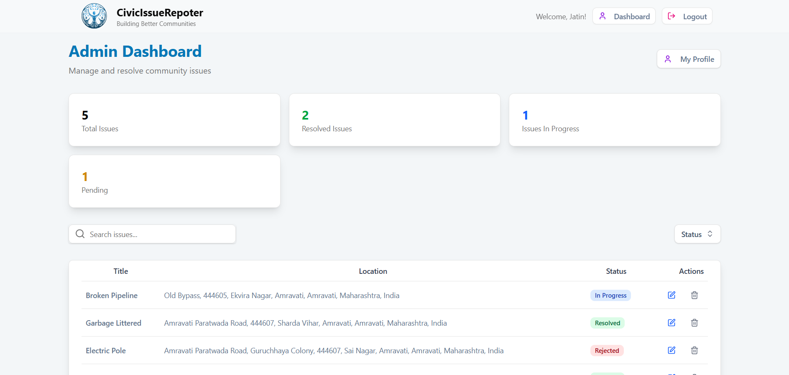
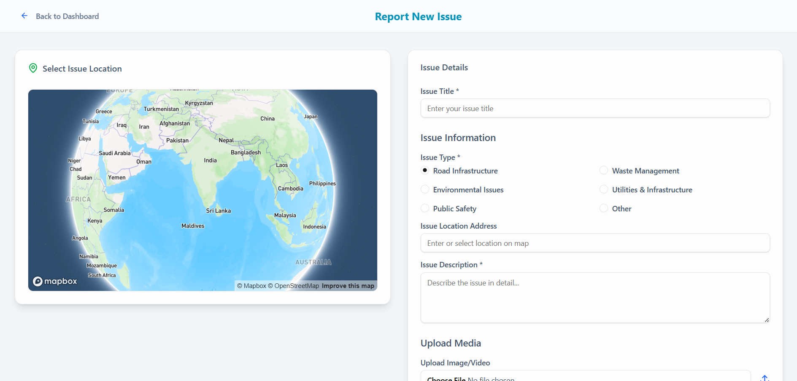

# Civic Issue Reporter (Civic Auth)

[](https://github.com/kass69/Civic-Issue-Reporter/releases)
[](https://vitejs.dev/)
[](https://reactjs.org/)
[](https://nodejs.org/)
[](https://www.typescriptlang.org/)
[](https://www.mongodb.com/)
[](https://auth.civic.com/)

> Civic Issue Reporter — a real-time civic issue reporting platform (forked & extended).  
> Built originally by **kass69** — this repository contains my changes and fixes for hackathon integration with Civic Auth. Big thanks and respect to the original author: https://github.com/kass69

Live demo: https://civic-issue-reporter-application.vercel.app/

---

## What is this?

Civic Issue Reporter is a full-stack web app that lets citizens report local civic problems (potholes, broken street lights, waste issues) with location, photos, and categories. Admins view and manage reports. This fork integrates **Civic Auth** for secure sign-in and a focused developer-friendly flow for rapid hackathon submission.

Key features

- Citizen sign-in via **Civic Auth** (OAuth/JWT)
- Create issue reports with location and optional photos
- Role-based views (citizen / admin)
- Uploads handled via Cloudinary (configurable)
- Map integration (Mapbox)
- Node + Express backend with MongoDB

---

## Screenshot / Preview


Landing page  


Citizen dashboard  


Admin dashboard  


Report flow  


---

## Getting started (local development)

Prerequisites

Node.js 18+ (recommended)

npm / pnpm / yarn

MongoDB Atlas cluster (or local Mongo)

Civic Auth account (https://auth.civic.com
) — client id

Cloudinary account (optional — for image uploads)

Mapbox token (optional — for map features)

Repo layout (assumes this repo structure)

- /frontend # Vite + React + TypeScript app

- /backend # Express + TypeScript backend

## git clone https://github.com/callmeKORRA03/forcivic

cd forcivic/civic_app

## frontend

cd frontend

npm install

## backend

cd backend

npm install

- Create .env in the backend folder

```# backend/.env
PORT=4000
MONGO_URI=mongodb+srv://<user>:<pass>@cluster0.abcde.mongodb.net/<dbname>?retryWrites=true&w=majority
JWT_PASSWORD=some_long_secure_secret_here
CIVIC_JWKS_URI=https://auth.civic.com/.well-known/jwks.json
CORS_ORIGIN=http://localhost:5173
CLOUDINARY_CLOUD_NAME=your_cloud_name
CLOUDINARY_API_KEY=your_cloudinary_api_key
CLOUDINARY_API_SECRET=your_cloudinary_secret
MAPBOX_TOKEN=your_mapbox_token
```

- Create .env or env.local in frontend:

```
# frontend/.env
VITE_API_URL=http://localhost:4000/api/v1
VITE_CIVIC_CLIENT_ID=<your_civic_client_id>
VITE_MAPBOX_TOKEN=your_mapbox_token
VITE_CLOUDINARY_UPLOAD_PRESET=your_upload_preset
```

Important: On production hosts (Vercel / Render) set the same env variables in the platform dashboard. Never commit .env to GitHub.

- Run backend & frontend locally

```
# backend
npm start

# frontend
npm run dev
# open http://localhost:5173
```

```
Contributing & credits

This project is primarily based on the original author and codebase maintained by kass69.

Original repo & project: https://github.com/kass69/Civic-Issue-Reporter

Thanks to the original maintainer for creating this useful starter. This fork/clone adds Civic Auth integration and other small fixes for hackathon readiness.
```
